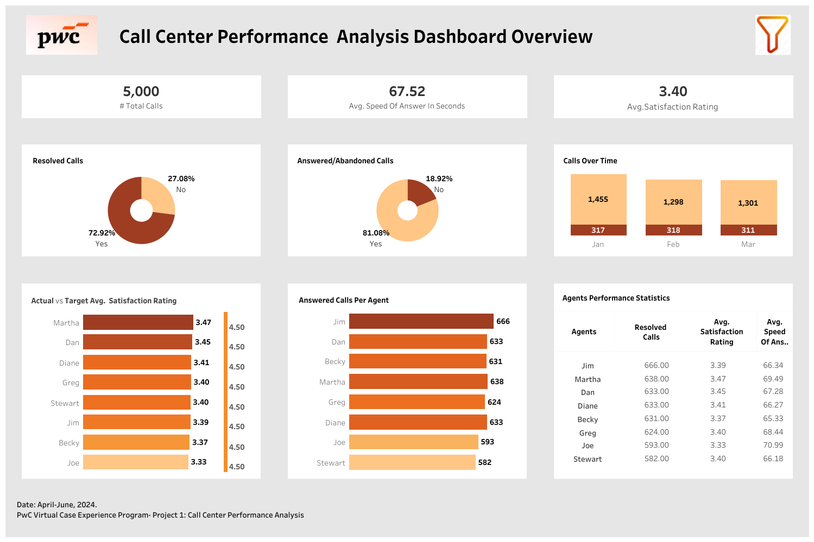

## Call Center Performance Analysis
###  Project Overview
As part of the **PwC Switzerland Business Intelligence Consultant Virtual Work Experience Program**, I analyzed **call center performance data** from *Call Now Customer Service Company*.  
The project evaluated **key customer service KPIs** and **agent performance** to identify efficiency gaps and opportunities for improvement.

---

### The Problem
The company required an in-depth analysis of:  
- **Average Speed of Answer (ASA)**  
- **Customer Satisfaction Ratings**  
- **Resolved vs. Unresolved Calls**  
- **Call Abandonment Rate**  
- **Individual Agent Performance**  

---

### Insights
- **Average Speed of Answer (ASA):** 67.5 seconds  
- **Average Satisfaction Rating:** 3.4 / 5  
- **Call Resolution:** 72.9% resolved, 27.1% unresolved  
- **Call Handling:** 81.1% answered, 18.9% abandoned  

**Agent Performance Trends** 

- **High Performers:** Martha, Dan, Diane (above-average satisfaction ratings)  
-  **Average Performers:** Greg, Stewart  
-  **Underperformers:** Jim, Becky, Joe (lower satisfaction ratings, slower responses)  

---

### Agents Performance Statistics

| Agent   | Resolved Calls | Avg. Satisfaction Rating | Avg. Speed of Answer (sec) |
|---------|----------------|---------------------------|-----------------------------|
| Jim     | 666            | 3.39                      | 66.34                       |
| Martha  | 638            | 3.47                      | 69.49                       |
| Dan     | 633            | 3.45                      | 67.28                       |
| Diane   | 633            | 3.41                      | 66.27                       |
| Becky   | 631            | 3.37                      | 65.33                       |
| Greg    | 624            | 3.40                      | 68.44                       |
| Joe     | 593            | 3.33                      | 70.99                       |
| Stewart | 582            | 3.40                      | 66.18                       |

---

### Recommendations
- **Targeted training & coaching** for underperforming agents (Jim, Becky, Joe) to improve service quality.  
-  **Performance-based incentives** for high performers (Martha, Dan, Diane) to sustain motivation.  
-  **Continuous KPI monitoring** to optimize call handling efficiency and reduce unresolved/abandoned calls.  

---

###  Skills Used
- **SQL** – Extracted and analyzed call center data  
- **Tableau** – Built interactive dashboards for KPIs and agent analysis  
- **Data Analysis** – Evaluated efficiency across key call center metrics  
- **Dashboard Development** – Visualized trends and agent performance  
- **Data Storytelling** – Communicated insights and recommendations effectively  

---

### Dashboard Preview

---

### Key Takeaway
By analyzing **call center KPIs** and **agent performance**, this project identified **bottlenecks and improvement opportunities**, enabling better **customer satisfaction** and **operational efficiency**.

---
